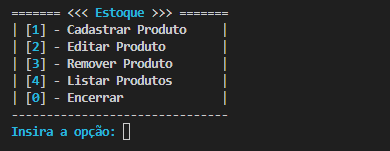

# Sistema de Controle de Estoque (CLI)

Este é um sistema de controle de estoque desenvolvido em Python para rodar no terminal. Ele permite cadastrar, editar, remover e listar produtos, além de calcular automaticamente o preço de venda com base em custos e margens.

## Funcionalidades

- Cadastro de produtos  
- Edição de informações (nome, descrição, custos e percentuais)  
- Remoção de produtos individuais ou limpeza total do estoque  
- Listagem e busca por produtos  
- Cálculo automático de:
  - Preço de venda  
  - Receita bruta  
  - Custos (fixos, comissão, impostos)  
  - Rentabilidade  
- Classificação de lucro (Alto, Médio, Baixo, Equilíbrio ou Prejuízo)  
- Criptografia e descriptografia da descrição do produto  
- Armazenamento em banco de dados local (SQLite)  

## Tecnologias utilizadas

- Python
- SQLite 
- NumPy  

## Como executar
### 1. Clone o repositório
```bash
git clone https://github.com/KachanChK/peoplechat
cd peoplechat
```
### 2. Crie o ambiente virtual e ative
#### Windows:
```bash
python -m venv .venv # Cria o ambiente virtual
.venv\Scripts\activate # Ativa o ambiente virtual
```
#### macOS/Linux:
```bash
python -m venv .venv # Cria o ambiente virtual
source .venv/bin/activate # Ativa o ambiente virtual
```

### 3. Instale os requisitos

```bash
pip install numpy
```

### 4. Execute o programa

```bash
python main.py
```

## Como funciona

O sistema é totalmente interativo via terminal. Ao iniciar, você verá um menu principal com opções numeradas:




Durante o cadastro, o sistema:
- Criptografa a descrição do produto  
- Calcula automaticamente o preço de venda  
- Valida percentuais (não podem somar 100% ou mais)  